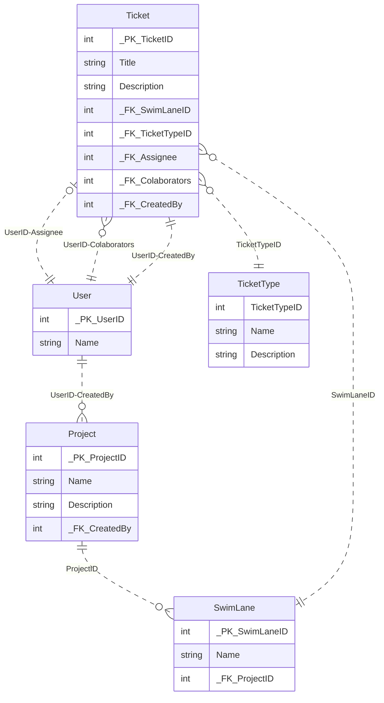

# ticketing-system-docs

```mermaid
erDiagram
    User {
        int _PK_UserID
        string Name
    }
    Project {
        int _PK_ProjectID
        string Name
        string Description
        int _FK_CreatedBy
    }
    SwimLane {
        int _PK_SwimLaneID
        string Name
        int _FK_ProjectID
    }
    TicketType {
        int TicketTypeID
        string Name
        string Description
    }
    Ticket {
        int _PK_TicketID
        string Title
        string Description
        int _FK_SwimLaneID
        int _FK_TicketTypeID
        int _FK_Assignee
        int _FK_Colaborators
        int _FK_CreatedBy
    }
    User ||-.o{ Project : UserID-CreatedBy
    
    Project ||-.o{ SwimLane : ProjectID
    
    Ticket }o-.|| SwimLane : SwimLaneID
    Ticket }o-.|| TicketType : TicketTypeID
    Ticket |o-.|| User : UserID-Assignee
    Ticket }o-.|| User : UserID-Colaborators
    Ticket ||-.|| User : UserID-CreatedBy


```